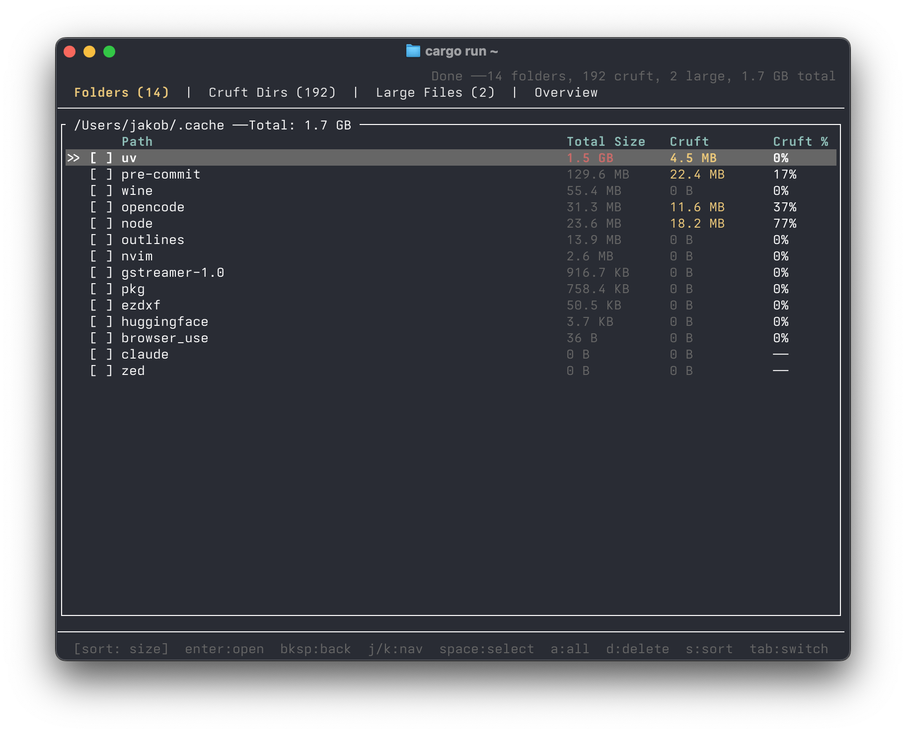

# space-check

TUI disk space analyzer that finds cruft folders and large files.



## Install

```sh
cargo install --path .
```

## Usage

```sh
space-check              # scan current directory
space-check ~/Projects   # scan a specific path
space-check -t 50        # set large file threshold to 50 MB (default: 100)
```

## Keybindings

| Key | Action |
|---|---|
| `j` / `k` | Navigate up/down |
| `Tab` / `Shift+Tab` | Switch tabs |
| `Space` | Toggle selection |
| `a` | Select all |
| `d` | Delete selected (or item under cursor) |
| `s` | Cycle sort |
| `Enter` | Drill into folder |
| `Backspace` | Go back |
| `q` / `Esc` | Quit |

## Tabs

- **Folders** -- Top-level folders by size, with cruft percentage
- **Cruft Dirs** -- Detected build artifacts, caches, and dependency folders
- **Large Files** -- Files exceeding the threshold
- **Overview** -- Category breakdown of cruft
